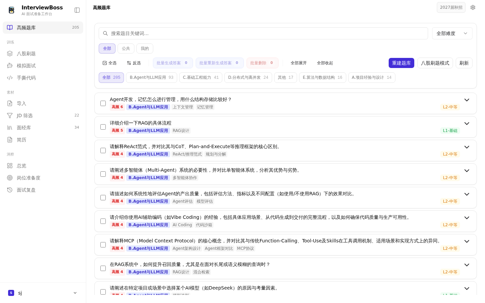
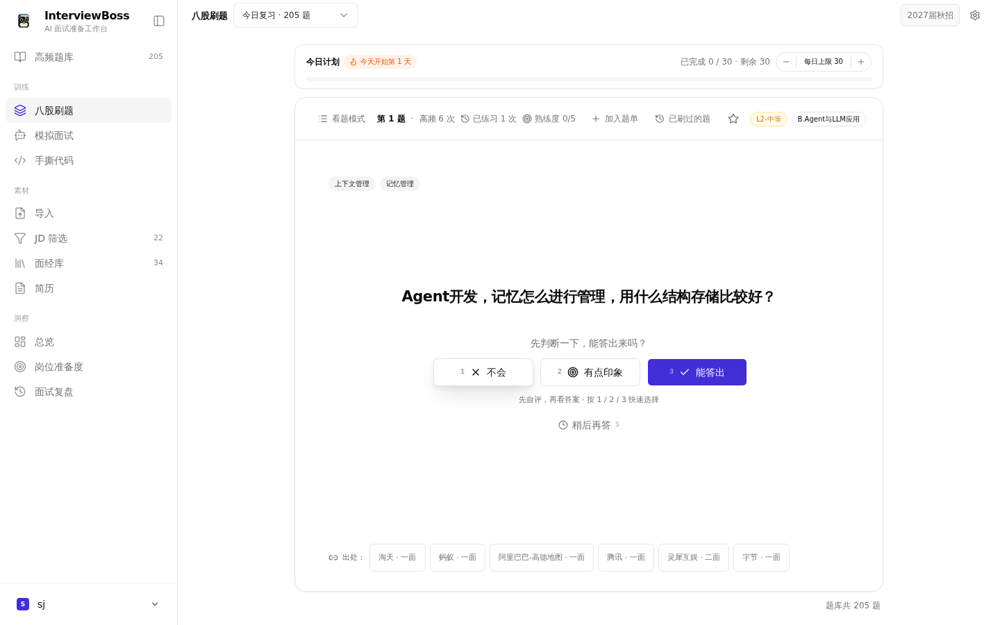
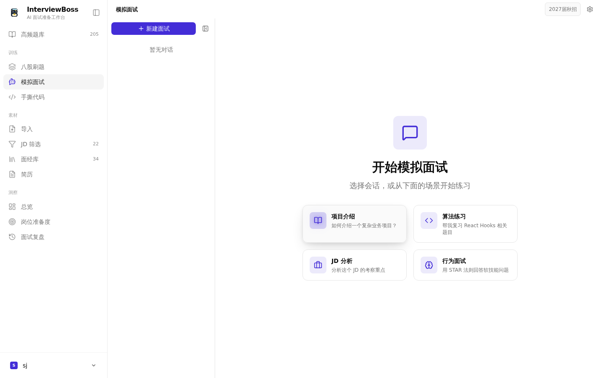

<div align="center">


# InterviewBoss

**粘贴 JD 和面经截图，AI 自动提取高频面试题、生成口述级答案，再用模拟面试检验实战水平。**

[](LICENSE)
[](https://python.org)
[](https://fastapi.tiangolo.com)
[](https://vuejs.org)
[](https://www.docker.com)

[产品简介](#产品简介) · [使用流程](#使用流程) · [界面截图](#界面截图) · [功能特性](#功能特性) · [技术栈](#技术栈) · [快速开始](#快速开始) · [部署](#部署) · [API 概览](#api-概览)

</div>

---

## 产品简介

面试准备太零散？JD 和面经散落在不同平台，真正开始准备时却不知道先看什么、练什么、还差什么？

InterviewBoss 是一个 **AI 驱动的面试备战工作台**：把 JD、面经、简历和截图集中起来，自动整理成岗位相关的高频题库，再通过答案生成、间隔复习和模拟面试，把“搜集资料”变成一条可以持续执行的准备计划。

它适合正在准备校招、社招或转岗面试的求职者，也适合希望沉淀行业题库的导师、教练和小团队。支持个人私有部署，并可使用任意 OpenAI 兼容模型（GPT、Claude 或国产模型）。

## 使用流程

```
┌─────────────┐     ┌──────────────┐     ┌──────────────┐     ┌──────────────┐
│  粘贴文本    │     │  LLM 识别     │     │  面试题提取   │     │  聚类去重     │
│  拖拽图片    │────▶│  JD / 面经    │────▶│  标签 + 难度  │────▶│  高频排序     │
│  混合输入    │     │  字段补全     │     │  分类体系归类 │     │  合并来源     │
└─────────────┘     └──────────────┘     └──────────────┘     └──────┬───────┘
                                                                      │
                    ┌──────────────┐     ┌──────────────┐            │
                    │  模拟面试     │     │  刷题复习     │            │
                    │  随机抽题     │◀────│  今日复习     │◀───────────┘
                    │  题型分布     │     │  题单 / 收藏  │
                    └──────────────┘     └──────────────┘
```

简单来说就是：

1. **导入资料**：粘贴目标岗位 JD、面经文本，或直接拖入截图和 PDF。
2. **整理重点**：AI 提取题目、合并重复内容，按考点、难度和出现频率生成题库，并补充口述级参考答案。
3. **开始训练**：每天复习最需要巩固的题目，或者进入模拟面试，让 AI 根据岗位和简历追问并给出反馈。

## 界面截图

以下截图来自真实登录后的工作台，展示了题库、复习和模拟面试三个核心场景。

<p align="center">
  
</p>

<p align="center">
  
  
</p>

## 功能特性

### 面向求职者

| 功能 | 说明 |
|------|------|
| **多模态输入** | 纯文本、图片拖拽/粘贴、文本+图片混合；LLM 自动识别内容类型、提取结构化字段、智能补全缺失字段 |
| **智能题库** | 面试题自动分类、打标签、标注难度并按考频排序；语义相近的问题自动聚类去重，同时保留来源和出现次数 |
| **AI 生成答案** | 针对基础原理、算法/手撕和系统设计等场景生成参考答案；支持按岗位和简历生成更适合个人背诵的版本 |
| **刷题复习** | 根据熟练度、出现频率和遗忘风险安排“今日复习”，支持题单、收藏、标记掌握程度和已掌握题抽查 |
| **模拟面试** | 按岗位配置项目深挖、理论问答、算法、系统设计和行为面等题型；AI 会连续追问，并从完整性、深度、准确性和逻辑性给出反馈 |
| **手撕代码** | 内置 50 道高频编程题 + Prompt/Markdown 导入扩充，轻量代码编辑器；AI 从语法、逻辑、算法、复杂度、代码风格 5 维评测（SSE 流式），支持完整评审与渐进提示两种模式 |
| **洞察工作台** | 面试洞察总览、岗位准备度雷达、面试复盘回顾、练习足迹热力图，ECharts 6 可视化 |
| **知识图谱** | 知识点关联网络、技术栈热度趋势、考点/难度分布、练习趋势 |
| **简历管理/优化** | PDF 简历上传/解析/删除，按目标岗位 LLM 优化建议 |

### 面向导师、教练与团队

| 能力 | 说明 |
|------|------|
| **公共 / 个人题库** | 在公共题库、个人题库和混用模式之间切换，适合个人积累或团队共享 |
| **题库审核与维护** | 管理员可以审核题目、处理误合并和漏合并、合并重复来源，并维护岗位分类体系 |
| **多用户与权限** | JWT 双 Token 认证、用户级数据隔离、共享范围控制和软删除回收站，降低误操作风险 |

### 高级能力

以下能力主要服务于自部署、自动化和深度使用场景：

| 能力 | 说明 |
|------|------|
| **AI 对话与 Skills** | 多轮对话、记忆系统、PDF 解析和 9 种面试技能，按对话内容自动切换训练策略 |
| **音频转写** | 上传面试录音自动转写（Deepgram），支持语言/模型查询 |
| **邮箱验证** | SMTP 验证码登录/注册/改密，邮箱绑定 |
| **全局联网搜索** | 答案生成时联网检索增强（tavily / brave / bocha / exa），全局与个人配置独立 |
| **MCP 接入** | 内置 Streamable HTTP MCP 服务（`list_job_positions` / `load_skill` / `search_questions` / `draw_questions` / `select_question`），外部 agent 可账户级 Token 接入检索和选题 |
| **管理 AI 助手** | 聚合质量审查的 LLM 对话助手，写操作内联确认 + 操作审计留痕 |
| **来源健康合并** | 检测同签名重复公共面经/JD，一键预览与合并 |
| **分类体系管理** | 岗位分类体系在线编辑、生成、公开共享 |
| **系统配置热更新** | LLM / Embedding / 联网搜索等参数在线修改并持久化，支持个人 LLM 配置独立管理 |
| **异步任务队列** | 独立 Redis queue + ARQ 后台处理耗时任务，job 持久化 + dispatcher 自动重试，queue 不可用不丢任务；另有独立 Redis cache 承载短期读模型缓存 |

## 技术栈

| 层级 | 技术 |
|------|------|
| 后端框架 | FastAPI + Uvicorn |
| 数据库 | SQLite（WAL 模式，自动迁移） |
| 任务队列 | Redis queue + ARQ（job 持久化 + dispatcher 重试） |
| 缓存 | 独立 Redis cache（master-bank 15 秒用户隔离缓存，故障自动回退 SQLite） |
| LLM | OpenAI / Anthropic 兼容 API（支持代理 / 国产模型 / thinking 模式） |
| Embedding | ONNX Runtime + bge-small-zh-v1.5 + FAISS（可切换 siliconflow / hash 后端） |
| Agent 框架 | LangGraph（submit/build/batch_generate）+ 自研 async chat harness（纯 async，替代 StateGraph） |
| 前端框架 | Vue 3 (Composition API) + Vite |
| UI | shadcn-vue + Tailwind CSS |
| 代码编辑器 | 轻量自定义编辑器（textarea 增强） |
| 图表 | ECharts 6 |
| 认证 | JWT 双 Token（Access + HttpOnly Refresh） |
| 日志 | structlog（生产 JSON / 开发彩色） |
| 部署 | Docker Compose |
| 包管理 | uv (Python) / npm (Node.js) |

## 快速开始

### 环境要求

- **Docker** + Docker Compose（v1 `docker-compose` 或 v2 `docker compose`）
- 本地开发另需 Python >= 3.12、Node.js >= 18、uv

### 1. 克隆项目

```bash
git clone https://gitee.com/satanstoy/interview-boss.git
cd interview-boss
```

### 2. 配置环境变量

```bash
cp backend/.env.example backend/.env
```

编辑 `backend/.env`，至少填入两项（首次启动会创建种子管理员）：

```env
# ── 必填 ──
OPENAI_API_KEY=sk-xxx                         # LLM API 密钥
ADMIN_PASSWORD=your-secure-password            # 种子管理员密码（首次启动必填）

# ── 可选（有默认值） ──
OPENAI_BASE_URL=https://api.openai.com/v1     # API 地址（支持代理/国产模型）
LLM_MODEL_NAME=gpt-4o                         # 模型名称
```

> 其他配置（Embedding 模型、相似度阈值、超时时间等）均有默认值，启动后可在设置页在线修改。

### 3. 启动服务（Docker 方式，推荐）

```bash
# 首次部署：构建镜像 + 启动所有服务
sudo ./deploy/docker-deploy.sh all

# 后续代码更新
sudo ./deploy/docker-deploy.sh update
```

首次启动自动创建数据库和种子管理员账号，浏览器打开 `http://localhost:8081` 注册即可使用（生产环境由宿主机 nginx 反代到 80 端口）。

### 本地开发（可选）

```bash
# 后端（通过 Docker 容器执行）
docker compose exec backend uv run uvicorn app.asgi:app --host 0.0.0.0 --port 8000

# 前端
cd frontend && npm install && npm run dev   # 打开 http://localhost:3000
```

## 环境变量

| 变量 | 说明 | 默认值 |
|------|------|--------|
| `OPENAI_API_KEY` | LLM API 密钥 | *(必填)* |
| `ADMIN_PASSWORD` | 种子管理员密码 | *(首次必填)* |
| `REDIS_URL` | Redis queue 连接地址（兼容旧配置别名） | `redis://localhost:6379/0` |
| `REDIS_QUEUE_URL` | ARQ queue Redis 连接地址 | 回退到 `REDIS_URL` |
| `REDIS_CACHE_URL` | 读模型 cache Redis 连接地址 | `redis://localhost:6380/0` |
| `MASTER_BANK_CACHE_TTL_SECONDS` | master-bank 缓存有效期（秒） | `15` |
| `OPENAI_BASE_URL` | LLM API 地址 | 空 |
| `LLM_MODEL_NAME` | 生成模型 | `gpt-4o` |
| `LLM_TIMEOUT` | LLM 超时（秒） | `120` |
| `JWT_SECRET` | JWT 签名密钥 | 自动生成 |
| `ADMIN_USERNAME` | 种子管理员用户名 | `sj` |
| `DEBUG` | 开启热重载和 Swagger 文档 | `false` |
| `ALLOWED_ORIGINS` | CORS 允许来源（逗号分隔） | 空 |
| `MAX_FILE_SIZE_MB` | 单文件最大上传大小（MB） | `10` |
| `MAX_TOTAL_UPLOAD_SIZE_MB` | 单次请求总上传大小（MB） | `50` |
| `EMBEDDING_BACKEND` | Embedding 后端（`onnx` / `siliconflow` / `hash` / `auto`） | `auto` |
| `EMBEDDING_MODEL_DIR` | ONNX 模型目录 | `/app/models/bge-small-zh-v1.5` |
| `EMBEDDING_OFFLINE` | 离线模式（不下载模型） | `0` |
| `SILICONFLOW_API_KEY` / `SILICONFLOW_BASE_URL` | siliconflow Embedding API 配置 | 空 / `https://api.siliconflow.cn/v1` |
| `EMBEDDING_API_MODEL` | API Embedding 模型 | `BAAI/bge-m3` |
| `CLUSTER_V2_SIM_THRESHOLD` | 聚类相似度阈值 | `0.6` |
| `CLUSTER_MIN_SIMILARITY` / `CLUSTER_DIRECT_ACCEPT_CONF` 等 | 聚类批处理参数 | 见 `core/config.py` |
| `SMTP_HOST` / `SMTP_PORT` | 邮件服务器（邮箱验证） | 空 / `465` |
| `SMTP_USERNAME` / `SMTP_PASSWORD` | 邮箱账号 | 空 |
| `SMTP_FROM` / `SMTP_FROM_NAME` | 发件人 | 空 / `InterviewBoss` |
| `SMTP_USE_TLS` | 是否启用 TLS | `true` |
| `SEARCH_PROVIDER` / `SEARCH_API_KEY` | 全局联网搜索（`tavily` / `brave` / `bocha` / `exa`） | `none` |
| `SEARCH_BASE_URL` | 搜索 API 自定义地址 | 空 |
| `MCP_PUBLIC_URL` | 外部 agent 访问 MCP 的公开地址 | 空 |
| `MCP_ALLOW_ANONYMOUS` | 允许匿名 MCP 访问（仅开发/测试） | `false` |

完整变量列表见 `backend/.env.example`。所有配置均可在运行时通过设置页在线修改，变更自动持久化到数据库和 `.env`。

## 部署

`deploy/docker-deploy.sh` 是生产部署入口，内置磁盘保护（构建前根分区至少保留 2GB，构建后低于 5GB 自动收缩 BuildKit cache）、镜像源健康检查与版本化缓存。

```bash
sudo ./deploy/docker-deploy.sh                 # 默认 all：构建 + 启动核心服务
sudo ./deploy/docker-deploy.sh build           # 仅构建镜像
sudo ./deploy/docker-deploy.sh up              # 启动核心服务
sudo ./deploy/docker-deploy.sh update          # 代码更新后重新部署（自动备份数据库）
sudo ./deploy/docker-deploy.sh frontend        # 仅前端变更：快速更新（npm build + 拷贝）
sudo ./deploy/docker-deploy.sh status          # 服务状态和资源使用
sudo ./deploy/docker-deploy.sh logs [backend]  # 查看日志
sudo ./deploy/docker-deploy.sh worker-up       # 按需启动异步 Worker
sudo ./deploy/docker-deploy.sh worker-down     # 停止 Worker
sudo ./deploy/docker-deploy.sh worker-restart  # 重建并重启 Worker
sudo ./deploy/docker-deploy.sh worker-logs     # 查看 Worker 日志
sudo ./deploy/docker-deploy.sh test            # 运行 pytest（可传参数）
sudo ./deploy/docker-deploy.sh check           # 日常质量门禁（backend/frontend/audit）
sudo ./deploy/docker-deploy.sh backup          # 备份数据库和 Redis 数据
sudo ./deploy/docker-deploy.sh cleanup         # 清理构建缓存（--dry-run 预览 / --aggressive 深清）
sudo ./deploy/docker-deploy.sh diagnose        # 磁盘/资源诊断
sudo ./deploy/docker-deploy.sh mirrors         # 刷新镜像源缓存（首次配置机器时）
sudo ./deploy/docker-deploy.sh migrate         # 停止宿主机服务（迁移 Docker 时）
sudo ./deploy/docker-deploy.sh down            # 停止所有服务
sudo ./deploy/docker-deploy.sh restart         # 重启核心服务
```

**部署策略：** 仅改前端样式/组件 → `frontend`（几秒生效）；改后端代码/依赖 → `update`（完整构建）；两者都改 → 先 `frontend` 验证，再 `update`。

**资源分配（2c4g 优化）：** Redis queue 128MB/0.25 CPU（`noeviction` + AOF），Redis cache 256MB/0.25 CPU（`allkeys-lru`、无持久化），Backend 512MB/0.75，Worker 384MB/0.75（按需启动），Nginx 64MB/0.25，OAuth Gateway 64MB/0.25。HuggingFace 模型缓存通过只读 volume 挂载，配合 `HF_HUB_OFFLINE=1` 离线运行。

## 项目结构

```
interview-boss/
├── backend/                    # Python FastAPI 后端
│   ├── app/
│   │   ├── core/               # 配置、认证、提示词模板、缓存、日志、面试题型配置
│   │   ├── routers/            # API 路由（HTTP 感知层，禁止业务逻辑）
│   │   │   ├── profile_pkg/    # 配置子路由（llm/taxonomy/position/email/resume 等）
│   │   │   └── questions_pkg/  # 题库操作子路由（mutations/bulk/share）
│   │   ├── services/           # 业务逻辑（LLM、聚类、pipeline、Chat、FTS、简历、搜索等）
│   │   │   └── clustering/     # LLM 聚类去重
│   │   ├── agents/             # LangGraph 状态机 + 自研 async chat harness
│   │   │   ├── submit/ build/ batch_generate/   # LangGraph 提交流水线
│   │   │   ├── chat/           # 纯 async 面试 agent（40+ 文件）
│   │   │   │   └── skills/     # 9 种面试技能（自适应难度、算法编码、HR 软技能等）
│   │   │   ├── candidate/      # 评测框架候选人 skill 包
│   │   │   └── shared/         # 共享状态/事件/质量模块
│   │   ├── db/                 # SQLite 连接、CRUD、查询、自动迁移
│   │   ├── middleware/         # ASGI 中间件（请求日志）
│   │   ├── models/             # Pydantic schemas
│   │   └── mcp_server/         # 外部 agent 接入的 MCP 工具服务
│   ├── main.py                 # 本地开发入口（uvicorn main:app）
│   ├── worker.py               # ARQ Worker 入口
│   ├── data/                   # SQLite 数据库文件（自动备份）
│   ├── scripts/                # 运维脚本（fix_/verify_/check_ 前缀）
│   └── tests/                  # 按功能域划分（bank/chat/coding/pipeline/services 等）
├── frontend/                   # Vue 3 + Vite 前端
│   ├── src/
│   │   ├── services/           # API 服务层（按领域拆分），http.js 是 HTTP 客户端
│   │   ├── composables/        # 领域逻辑复用（use* 前缀，20 个）
│   │   ├── components/         # common 通用 / business 业务 / ui shadcn-vue
│   │   ├── views/              # 页面级组件（MasterBank/Chat/Jd/Interview/Practice/Insights 等）
│   │   ├── router/ layouts/ stores/ utils/ constants/
│   └── tests/                  # Playwright 测试（mock API）
├── deploy/                     # 部署脚本（docker-deploy.sh 生产入口）
├── docs/                       # 历史经验库（bug-reports、tdd-reports、adr、specs 等）
├── nginx/                      # Docker Nginx 配置（API 反代 + SPA + 安全头）
├── oauth-gateway/              # ChatGPT MCP 连接器 OAuth 2.1 网关（独立 FastAPI 服务）
├── scripts/                    # 项目级辅助脚本（check.sh 质量门禁入口）
├── Dockerfile                  # 多阶段构建（前端 + 后端 + nginx + test-runtime）
├── docker-compose.yml          # 容器编排（Redis×2 + Backend + Worker + Nginx + OAuth Gateway）
├── pyproject.toml              # Python 依赖定义（uv）
└── logo.svg                    # 品牌矢量 Logo
```

## 开发

### 测试与质量门禁

pytest 必须通过 Docker `test-runtime` 执行（生产 backend 容器不含 dev 依赖）：

```bash
./deploy/docker-deploy.sh test -q                          # 后端全量测试
docker compose --profile test run --rm test uv run pytest backend/tests/bank/ -q
./deploy/docker-deploy.sh check                            # 日常质量门禁（后端 + 前端 build/test + audit 报告）
```

后端测试按功能域组织：`bank/`（题库）、`chat/`（模拟面试）、`pipeline/`（提交流水线）、`services/`（业务逻辑）、`coding/`（手撕代码）、`security/`（安全）、`infra/`（基础设施）、`taxonomy/`（分类体系）、`interview/`（面试管理）。

前端测试使用 Playwright，必须 mock API，禁止截图断言。

### 开发规范

- **TDD 强制**：先写失败测试 → 最小实现 → 重构
- **Commit**：[Conventional Commits](https://www.conventionalcommits.org/)（`feat:` / `fix:` / `docs:` 等），英文
- **分支**：`master` 保持可部署；常规修改直接提交 master，复杂功能用 `feature/*` 分支
- **依赖**：Python 用根目录 `uv add X`；JS 用 `frontend/` 下 `npm install X`

## API 概览

| 领域 | 主要端点 |
|------|---------|
| 认证 | `/api/auth/register` `/api/auth/login` `/api/auth/refresh` `/api/auth/logout` `/api/auth/send-code` `/api/auth/login-with-email` `/api/auth/reset-password` 等 |
| 内容提交 | `/api/submit-stream-v2`（SSE 进度推送）、`/api/submit-jobs` `/api/submit-jobs/active` `/api/submit-jobs/{id}/retry` |
| 数据管理 | `/api/data/{file_type}`（JD/面经 CRUD、回收站、批量删除/恢复） |
| 题库管理 | `/api/master-bank`（列表/搜索/详情）、`/api/master-bank/build` `compact` `build-personal`（SSE）、`/api/master-bank/upload`、`split-question` `merge-question` `re-tag`、`trash` `restore`、`toggle-star`、`share`、审核 `pending/approve/reject`、`merge-history` |
| 答案生成 | `/api/master-bank/generate-answer` `/batch-generate-answers` `/generate-recitation` `/save-user-answer`（SSE 流式） |
| 刷题复习 | `/api/practice/decks`（题单 CRUD）、`/api/practice/review`（间隔复习）、`/api/practice/practiced`、`/api/evaluate-answer`、`/api/master-bank/random` |
| 模拟面试 | `/api/chat/conversations`（CRUD）、`/api/chat/conversations/{id}/messages`（SSE）、`regenerate`、`memories`、`/api/chat/extract-pdf` |
| 面试管理 | `/api/interview/experiences`、`/api/interview/{id}/re-process-stream`、`/api/interview/batch-reprocess-stream` |
| 题型分布 | `/api/interview/distribution/default`、`/api/profile/interview-distribution-preference` |
| 手撕代码 | `/api/coding/problems`（题目/收藏/题单/导入）、`/api/coding/submit`（SSE 评测）、`/api/coding/submissions`、`/api/coding/error-stats` |
| 洞察与数据 | `/api/insights`、`/api/insights/practice-activity`、`/api/analytics`、`/api/practice-stats`、`/api/knowledge-graph` |
| 用户配置 | `/api/profile`（配置读写 + 个人 LLM/Embedding）、`/api/profile/resume`、`/api/profile/search`、`/api/profile/taxonomy`、`/api/profile/mcp`、`/api/profile/recruitment` |
| 音频转写 | `/api/audio/transcribe`、`/api/audio/models`、`/api/audio/languages` |
| 管理 | `/api/admin/quality-issues/*`（质量审查）、`/api/admin/assistant/*`（AI 助手）、`/api/admin/source-health/*`（来源健康） |
| 系统 | `/api/health`、`/api/error-report` |

完整端点明细：开发模式下（`DEBUG=true`）访问 `http://localhost:8000/docs` 查看 Swagger UI。

### MCP 接入（外部 Agent）

系统内置 Streamable HTTP MCP 服务（工具：`list_job_positions` / `load_skill` / `search_questions` / `draw_questions` / `select_question`），外部 agent 可在「设置 → MCP 接入」生成账户级 Token 后接入（原生 HTTP 或 `npx mcp-remote` stdio 兼容）：

```json
{
  "mcpServers": {
    "interview-boss": {
      "url": "https://interviewboss.online/mcp",
      "headers": { "Authorization": "Bearer ib_mcp_..." }
    }
  }
}
```

详见 [InterviewBoss MCP 外部 Agent 使用说明](docs/agents/interview-boss-mcp.md)。

## 安全与隐私

- 认证：JWT 双 Token，Refresh Token 存 HttpOnly Cookie 防 XSS 窃取；全局速率限制（200 次/分钟）；密码 bcrypt 加密；CSRF 中间件
- 权限：题库操作校验用户可见范围（`bank_mode` + `owner_id`）防权限提升；分析数据按用户隔离
- 响应头：Nginx + 后端中间件双重安全头（CSP、HSTS、X-Frame-Options 等）
- 数据：软删除 + 回收站；`.gitignore` 排除 `.env`、`*.db` 等敏感文件

**严禁**将 `.env`、API 密钥、数据库文件或任何含真实凭证的文件提交到 Git 仓库。

## 贡献

欢迎提交 Issue 和 PR：

1. Fork 仓库，从 `master` 创建功能分支
2. 遵循 [Conventional Commits](https://www.conventionalcommits.org/) 规范，改动附带测试
3. 提交前通过 `./deploy/docker-deploy.sh check` 质量门禁
4. 提交 PR 描述改动动机与验证结果

## 许可证

[MIT](LICENSE)
