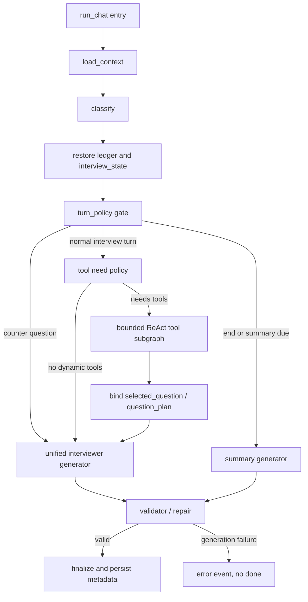

# Spec: Hybrid Chat Agent Architecture

> 位置: `backend/app/agents/chat/`  
> 类型: 架构纠偏 spec  
> 日期: 2026-07-09  
> 状态: 待实施  
> 触发背景: LangGraph 全工作流替换上线后，开场寒暄场景出现跳出面试官角色的元说明回复。

## 结论

当前不应继续把模拟面试主链路完全改成 LangGraph 分支节点生成。正确方向是:

```text
LangGraph / workflow 负责外层状态编排和不可跳过的业务合同；
ReAct / tool loop 负责需要动态工具决策的子任务；
统一 Interviewer Generator 负责所有面向候选人的自然表达；
Validator / Repair 负责输出合同，不允许机械 fallback。
```

也就是说，LangGraph 要保留，但从“替代 ReAct loop 的主生成器”降级为“外层 orchestration runtime”。自然对话不要分散在 `bank_question`、`natural_followup`、`answer_counter_question` 等节点内各自生成。

## 外部实践调研摘要

### LangGraph 官方定位

LangGraph 官方文档将其定位为低层 agent orchestration framework/runtime，重点能力是 durable execution、streaming、human-in-the-loop、memory、debugging 和 deployment。文档也明确区分 LangGraph、LangChain agents 和 Deep Agents: LangGraph 是 runtime，LangChain agents 是 agent loop/harness 抽象。

对本项目的含义:

- 可以用 LangGraph 表达长会话状态、暂停/恢复、节点可观测性和必经状态。
- 不应该假设“用了 LangGraph 就要把每种自然回复拆成一个 graph node”。
- 如果只是常见工具循环，现有 ReAct loop 或 LangChain/Agents 风格的 harness 更接近主流用法。

参考:

- https://docs.langchain.com/oss/python/langgraph/overview
- https://docs.langchain.com/oss/python/langgraph/workflows-agents

### Anthropic: workflows 和 agents 要分层

Anthropic 的 agent 实践文章给出的关键区分是:

- workflow: LLM 和工具按预定义代码路径编排，适合可预测、可拆解任务。
- agent: LLM 动态决定流程和工具使用，适合开放、变化大的任务。

它还强调从简单、可组合模式开始，只有在收益超过成本时增加复杂度；框架可能隐藏底层 prompt/response，从而降低可调试性。

对本项目的含义:

- 结束流程、反问优先级、题库绑定、无 fallback 这些是 workflow 合同。
- 候选人自然回答后的项目深挖、工具是否需要继续调用，是 agent/harness 行为。
- 将所有自然追问塞进 workflow 分支，会牺牲面试官的上下文连续性。

参考:

- https://www.anthropic.com/engineering/building-effective-agents

### OpenAI Agents SDK: 少量原语，而不是全局二选一

OpenAI Agents SDK 文档强调 primitives: agents、tools、handoffs、guardrails、sessions、tracing。它也明确说不需要全局选择一种方式，很多应用会同时使用 managed workflows 和低层自定义路径。

对本项目的含义:

- 现有 skills/MCP/tool gateway 能继续作为 tools 和上下文增强层复用。
- ReAct 子流程可以视作一个 bounded agent/tool loop。
- Guardrails、sessions、tracing 应该成为主链路的一等公民，而不是散落在各节点。

参考:

- https://developers.openai.com/api/docs/guides/agents
- https://openai.github.io/openai-agents-python/
- https://openai.github.io/openai-agents-python/handoffs/

## 当前实现问题

### 1. 工作流替代了生成器

当前 `workflow.py` 的 LangGraph 路径是:

```text
load_context -> classify -> turn_controller -> branch node -> finalize
```

branch node 包括:

- `bank_question`
- `natural_followup`
- `answer_counter_question`
- `closing_summary`
- `complex_open_task`

问题是普通分支直接生成面向候选人的最终回复。比如 `natural_followup` 根据最后一条候选人回答组装一个独立 prompt:

```text
候选人刚才回答：...
请作为面试官，基于候选人的回答进行深入追问。
```

当候选人只说“你好面试官”时，这个节点缺少开场语境、面试角色连续性和统一 harness，模型容易生成“请提供岗位/背景信息”这类元说明。

### 2. 面试官人格和节奏被分散

原 ReAct 路径至少有统一的:

- `build_react_system_prompt()`
- full-loop harness
- skill 注入
- tool-use skill
- question plan 注入
- `_stream_final_answer()`
- `_enforce_question_plan_on_text()`
- OutputGuard

全 LangGraph 分支把生成拆散后，每个分支都要重新维护角色、语气、工具边界、题目合同、上下文 grounding、summary 规则。可维护性变差，也容易产生行为不一致。

### 3. 状态正确不等于体验正确

这次改动后，状态流转测试能证明:

- full graph 有 setup 节点。
- `bank_question` 写回 `selected_question`、`question_plan` 等字段。
- error 不补空 `done`。
- 多轮 metadata 可以恢复。

但这些测试不能证明面试官回复自然。前端真实 E2E 暴露的是“生成层上下文被切碎”的问题，而不是“状态字段没有写回”。

### 4. 当前热修不能作为长期方案

为修复“你好面试官”场景，可以在 `natural_followup` 中识别开场寒暄并返回自我介绍引导。但这只是止血。继续堆类似特判会让 workflow 变成新的 prompt/规则泥潭。

## 目标

1. 恢复面试官自然对话质量，避免跳出角色、机械切题、元说明回复。
2. 保留 LangGraph 对状态流转、可观测性、强合同和错误终止的价值。
3. 保留并复用现有 ReAct、skills、MCP、tool gateway、question plan、guardrails。
4. 删除“工作流分支各自生成最终回复”的架构。
5. 建立多轮 E2E，真实验证状态流转 + 对话行为 + metadata 持久化。
6. 继续坚持: 不能自然生成时直接 error，不使用机械 fallback 伪造成功。

## 非目标

- 不切换到 LangGraph 官方预构建 agent 作为唯一运行时。
- 不迁移或重写现有 skills 为另一套“官方 skill 组件”。
- 不把 MCP 工具接入方式改成多套并存。
- 不为了工具调用率牺牲自然面试节奏。
- 不重新引入固定前缀题干 fallback，例如“好，XXX？”。

## 目标架构



### 层级划分

| 层 | 职责 | 允许 LLM 生成最终回复吗 |
| --- | --- | --- |
| LangGraph outer workflow | setup、分类、状态恢复、硬路由、错误终止、事件汇总、可观测性 | 否，除非调用统一 generator |
| TurnPolicy | 判断本轮是否 summary、反问、普通追问、工具子流程、收尾 | 否 |
| Bounded ReAct subgraph | 动态调用 `load_skill/search_questions/draw_questions/select_question`，产出候选题/工具结果/skill 状态 | 不直接面向用户输出最终回复 |
| Unified Interviewer Generator | 用统一 prompt/harness 生成候选人可见回复 | 是 |
| Validator / Repair | 检查角色、题目计划、grounding、summary、counter question、禁止内部信号泄露 | 否；只允许 repair 或 error |

## ReAct 放在哪里

ReAct 不再是“所有状态都由它管”的全局主循环，也不应该被 LangGraph 完全替代。它的位置是:

```text
TurnPolicy 判断本轮需要动态工具/skill/MCP
  -> 进入 bounded ReAct tool subgraph
  -> ReAct 只产出 tool observations 和 plan
  -> 统一生成器根据 state + observations 生成最终面试官回复
```

### 什么时候进入 ReAct

进入:

- 需要 `load_skill` 注入专业策略。
- 需要 `search_questions` / `draw_questions` / `select_question`。
- 需要 MCP 工具获取外部或结构化上下文。
- 用户请求较开放，需要多步工具判断。

不进入:

- 开场寒暄、自我介绍邀请。
- 候选人刚做自我介绍后的项目自然深挖。
- 候选人反问，优先简短回答并拉回面试。
- 结束总结，由 summary workflow 处理。
- 当前回答明显不完整，需要继续澄清。

## Skills 和 MCP 复用策略

### Skills

保留现有 `backend/app/agents/chat/skills/` 体系:

- Skill 继续是 progressive disclosure 的 prompt package。
- `active_skill_names` 跨轮持久化仍只保存名称，不保存全文。
- `load_skill` 仍是工具，但只在 ReAct 子流程或 tool policy 需要时调用。
- always-active 的 tool-use skill 继续注入工具使用规范。

不迁移到另一套 LangGraph “skill component”。当前主流框架的共同抽象是 tools、middleware、handoffs、guardrails、sessions，而不是要求所有 skill 改造成框架私有格式。现有 skill 可以作为应用层能力保留。

### MCP / Tool Gateway

保留当前统一 gateway:

- `load_skill`
- `search_questions`
- `draw_questions`
- `select_question`

工具执行仍集中在 `app.services.interview_tools`，`tools.py` 只做 ReAct schema、JSON 转发和 state 同步，外部 MCP adapter 不参与内部流程决策。

## 状态合同

### 本轮输入状态

`load_context` 后必须具备:

- `conversation_id`
- `user_id`
- `user_message`
- `recent_messages`
- `message_history`
- `resume_summary`
- `session_notes`
- `interview_config`
- `interview_state`
- `exposed_question_ids`
- `active_skill_names`

### 分类状态

`classify` 必须写入:

- `intent`
- `answer_quality`
- `question_type`
- `should_retrieve`
- `requires_bank_question`
- `counter_question`
- `counter_question_topic`
- `transition_style`
- `classify_result`

分类可以错，但后续只允许通过 guardrail 做有限纠偏，不允许分支节点临时重新理解整场面试。

### TurnPolicy 输出

新增或收敛为一个结构化对象:

```python
class TurnDecision(BaseModel):
    action: Literal[
        "ask_self_intro",
        "natural_followup",
        "answer_counter_question",
        "tool_planning",
        "ask_bank_question",
        "candidate_question_prompt",
        "final_summary",
        "error",
    ]
    reason: str
    requires_tools: bool = False
    requires_question_plan: bool = False
    generation_mode: Literal["unified_interviewer", "summary"] = "unified_interviewer"
    blocked_by: str | None = None
```

### ReAct 子流程输出

ReAct 子流程不直接完成用户可见回复，而是写:

- `retrieved_questions`
- `candidate_questions`
- `selected_question`
- `next_question_plan`
- `active_skill_names`
- `tool_steps`
- `question_source`
- `question_source_reason`
- `generation_inputs.tool_observations`

如果必须绑定题库题但无法选题，直接写 `generation_error` 并产出 `error`，不进入统一生成器伪造题目。

### 统一生成器输出

统一生成器负责产出:

- SSE `chunk`
- `natural_question_text`
- `asked_question_text`
- `assessment_focus`
- `coverage_events`
- `reasoning_trace` / `tool_calls_trace` 摘要

统一生成器必须读取同一套 prompt/harness:

- 面试官角色
- 中国互联网大厂 full-loop rhythm
- 当前 `interview_state`
- 当前 `TurnDecision`
- 当前 `question_plan`
- 最近候选人回答
- 已问题 ledger
- active skills 摘要
- tool observations 摘要

### Validator / Repair 输出

Validator 检查:

- 角色没有跳出面试官身份。
- 没有要求用户提供“岗位/简历/之前的问题”等系统侧信息。
- `must_ask` 题目被问到。
- 候选人反问已先被回答。
- 结束总结结构完整。
- 没有凭空引入候选人未提及的项目实体。
- 没有内部 marker、工具名泄露给候选人。

Repair 只允许一次。修复失败:

```json
{"type": "error", "code": "generation_contract_failed", "message": "..."}
```

不得补空 `done`，不得机械 fallback。

## 短期实施方案

### Step 0: 止血

生产默认回到稳定路径:

```text
CHAT_AGENT_WORKFLOW=react
```

或者新增:

```text
CHAT_AGENT_WORKFLOW=hybrid
```

其中:

- `react`: 当前稳定兼容路径。
- `langgraph`: 保留给实验和测试，不作为生产默认。
- `hybrid`: 新架构灰度路径。

当前 `natural_followup` 的寒暄热修可以保留为保护测试，但不能继续沿这个方向扩张。

### Step 1: 先补行为 E2E

新增 `backend/tests/chat/test_hybrid_agent_state_flow_e2e.py`，覆盖真实多轮:

1. 创建对话，系统开场要求自我介绍。
2. 用户: `你好面试官`。
   - 期望: 回复继续邀请自我介绍。
   - 禁止: `请提供岗位信息`、`之前的问题`、`候选人简历`、`你设置这个面试场景`。
   - 状态: `turn_decision.action=ask_self_intro` 或 `natural_followup` 但 `generation_mode=unified_interviewer`。
3. 用户给出自我介绍和项目背景。
   - 期望: 不立即机械抽题，先项目深挖。
   - 状态: `question_source=conversation`，写入 `assessment_focus` 和 `coverage_events`。
4. 用户回答完整技术细节。
   - 期望: 可进入工具子流程，检索或抽题。
   - 状态: `tool_steps` 存在，`selected_question` / `question_plan` 写回，`asked_question_text` 命中计划题。
5. 用户提出反问。
   - 期望: 先回答反问，不调用 search/draw。
   - 状态: `counter_question_answered=true`，本轮不新增题库 coverage。
6. 用户请求结束。
   - 期望: 结构化总结。
   - 状态: `has_summary=true`，`closing_stage=closed` 或等价字段。

该 E2E 必须断言:

- SSE 事件顺序。
- 状态字段写回。
- message metadata 持久化。
- 第二轮/第三轮从 DB 恢复状态。
- generation error 时不补空 `done`。

### Step 2: 抽出统一生成器

新增:

```text
backend/app/agents/chat/interviewer_generator.py
```

职责:

- 封装当前 `_stream_final_answer()`、harness prompt、question plan prompt、active skills、tool observations。
- 对外提供一个入口:

```python
async def stream_interviewer_response(state: ChatState, decision: TurnDecision) -> AsyncIterator[dict]:
    ...
```

原 `natural_followup`、`bank_question`、`counter_question` 分支不得各自直接 `_call_llm` 生成最终候选人可见回复。

### Step 3: 拆分 ReAct loop

短期可以先复用 `_react_loop()` 作为 `react` 模式默认路径。

中期将 `_react_loop()` 拆成:

```text
react_tool_loop.py       # 工具决策、工具调用、state/tool_steps
interviewer_generator.py # 最终面试官回复
```

在 hybrid 模式中:

- `react_tool_loop` 不直接输出最终回复。
- 工具失败且本轮必须工具成功时，直接 error。
- 工具非必须失败时，记录 `retrieval_gap`，由统一生成器自然继续，不伪造题库题。

### Step 4: 重写 LangGraph workflow

`workflow.py` 不再包含 `_handle_bank_question()` / `_handle_natural_followup()` 这类最终回复生成逻辑。

目标节点:

```text
load_context
classify
restore_runtime_state
turn_policy
tool_subgraph
bind_question_plan
generate_response
validate_response
finalize
error
```

条件边:

```text
turn_policy -> final_summary
turn_policy -> generate_response
turn_policy -> tool_subgraph
tool_subgraph -> bind_question_plan -> generate_response
generate_response -> validate_response -> finalize
validate_response -> error
```

### Step 5: 收紧 feature flag 和回滚

新增配置:

```text
CHAT_AGENT_WORKFLOW=react|hybrid|langgraph_legacy
```

规则:

- `react`: 生产稳定默认。
- `hybrid`: 新架构灰度。
- `langgraph_legacy`: 当前全工作流替换路径，仅保留临时对照测试，后续删除。

部署策略:

- 先生产回 `react`。
- `hybrid` 通过 Docker 小规模 E2E。
- 再前端手测。
- 最后才切生产。

## 中期实施方案

### 1. 状态可观测性

所有 assistant message metadata 应包含:

- `turn_decision`
- `interview_state`
- `coverage_events`
- `selected_question`
- `question_plan`
- `tool_steps`
- `reasoning_trace`
- `generation_contract`

`generation_contract` 示例:

```json
{
  "mode": "unified_interviewer",
  "validated": true,
  "repair_attempted": false,
  "blocked_reason": null
}
```

### 2. 评测指标调整

新增或升级指标:

- `role_adherence`: 是否跳出面试官角色。
- `counter_question_answered_before_pivot`: 反问是否先回答再继续。
- `question_plan_adherence`: 计划题是否被问到。
- `no_mechanical_fallback`: 是否没有固定模板题干。
- `state_restored_across_turns`: 多轮 metadata 是否回灌。
- `conversation_naturalness`: 人审或 LLM judge 判断自然承接，不以工具调用率替代质量。

工具调用率只作为诊断指标，不作为产品目标。

### 3. 删除 legacy LangGraph branch

当 hybrid 连续通过:

- 单元测试。
- 多轮 DB-backed E2E。
- 小规模真实前端 E2E。
- 现有 eval 场景。

即可删除:

- branch-specific `_handle_natural_followup`
- branch-specific `_handle_bank_question`
- branch-specific `_handle_counter_question`
- `langgraph_legacy` flag

## 文件改动范围

### 必改

- `backend/app/agents/chat/pipeline.py`
- `backend/app/agents/chat/workflow.py`
- `backend/app/agents/chat/turn_controller.py`
- `backend/app/agents/chat/state.py`
- `backend/app/agents/chat/answer.py`
- `backend/app/agents/chat/react_loop.py`
- `backend/app/agents/chat/question_plan.py`
- `backend/app/agents/chat/metadata.py`
- `backend/app/agents/chat/coverage_events.py`
- `backend/app/agents/chat/CLAUDE.md`

### 新增

- `backend/app/agents/chat/interviewer_generator.py`
- `backend/app/agents/chat/turn_decision.py`
- `backend/tests/chat/test_hybrid_agent_state_flow_e2e.py`

### 可能调整

- `backend/app/agents/chat/tool_strategy.py`
- `backend/app/agents/chat/output_guardrails.py`
- `backend/tests/chat/test_react_loop.py`
- `backend/tests/chat/test_workflow.py`
- `backend/tests/chat/test_langgraph_state_flow_e2e.py`

## 验收标准

### 行为验收

- 开场只寒暄时，回复继续邀请自我介绍，不跳出角色。
- 自我介绍后优先项目深挖，不机械切题。
- 候选人回答完整后，可以自然进入题库/系统设计/算法题。
- 候选人反问时先回答反问，再回到面试。
- 结束时生成结构化总结。
- LLM/tool 失败时返回 error，不用机械 fallback 假装成功。

### 状态验收

- 每轮都有 `turn_decision`。
- 题库题有 `selected_question`、`question_plan`、`asked_question_text`。
- conversation-only 追问有 `assessment_focus`、`coverage_events`。
- 第二轮以后能从 DB metadata 恢复 `exposed_question_ids`、coverage、active skills。
- error 事件不会跟随空 `done`。

### 测试验收

必须通过:

```bash
docker compose --profile test run --rm -v "$PWD/backend:/app/backend" test /app/.venv/bin/python -m pytest \
  backend/tests/chat/test_hybrid_agent_state_flow_e2e.py \
  backend/tests/chat/test_workflow.py \
  backend/tests/chat/test_react_loop.py \
  backend/tests/chat/test_react_e2e.py \
  backend/tests/chat/test_counter_question.py \
  backend/tests/chat/test_proper_end.py \
  -q
```

部署前追加:

```bash
docker compose --profile test run --rm -v "$PWD/backend:/app/backend" test /app/.venv/bin/python -m pytest backend/tests/chat/ -q
```

## 风险

| 风险 | 应对 |
| --- | --- |
| hybrid 引入双路径复杂度 | 保留 `react` 稳定默认，`hybrid` 灰度；通过 E2E 再切 |
| ReAct 拆分影响大量测试 | 先抽统一生成器，后拆 tool loop；不要一步到位 |
| Validator 太严格导致误杀 | validator 分级: hard fail / repairable / warning；题目计划和角色跳出必须 hard fail |
| 继续补特判 | spec 明确禁止 branch-specific 最终回复生成，新增 case 必须进入统一生成器或 TurnPolicy |
| 工具调用率下降 | 接受下降；以 question_plan 命中和自然度为主指标 |

## 实施顺序建议

1. 生产回滚到 `react` 默认，保留当前 LangGraph 代码作为实验分支。
2. 写 `test_hybrid_agent_state_flow_e2e.py`，先覆盖“你好面试官”多轮问题和反问问题。
3. 新增 `TurnDecision` schema。
4. 新增 `interviewer_generator.py`，先复用当前 ReAct 最终生成能力。
5. 改 `workflow.py` 为 hybrid outer graph，只让 `generate_response` 调统一生成器。
6. 将工具调用从最终生成中逐步拆出为 bounded ReAct tool subgraph。
7. 跑 Docker chat 测试和小规模真实 E2E。
8. 灰度切 `CHAT_AGENT_WORKFLOW=hybrid`。
9. 删除 `langgraph_legacy`。

## 给执行 agent 的派发 prompt

```text
你在 /home/ubuntu/sj/interview-boss 工作。请先阅读 CLAUDE.md、backend/app/agents/chat/CLAUDE.md，以及 docs/specs/2026-07-09-hybrid-chat-agent-architecture.md。

目标：按 spec 将当前 LangGraph 全工作流替换纠偏为 hybrid chat agent。短期先保证生产默认回到 react 稳定路径，并新增多轮 E2E 覆盖开场寒暄、自我介绍、项目追问、题库选题、候选人反问、结束总结。

约束：
- 必须 TDD：先写 failing test，再改实现。
- pytest 必须走 Docker test runtime。
- 不要重新引入机械 fallback；生成失败应 error，不补空 done。
- 不要把 natural_followup/bank_question/counter_question 各自做最终 LLM 生成；最终回复必须经统一 Interviewer Generator。
- 保留现有 skills、MCP、tool gateway、question_plan、coverage_events。
- 修改后更新 backend/app/agents/chat/CLAUDE.md 和相关 tests/CLAUDE.md。

优先级：
1. 止血：生产默认 react 或新增 hybrid flag，不让 langgraph legacy 成为默认。
2. 新增 test_hybrid_agent_state_flow_e2e.py，覆盖真实多轮状态流。
3. 抽 TurnDecision 和 interviewer_generator.py。
4. 重写 workflow.py 为 outer orchestration，不再由分支节点直接生成最终回复。
5. 验证：运行 spec 中列出的 Docker pytest 命令。
```
